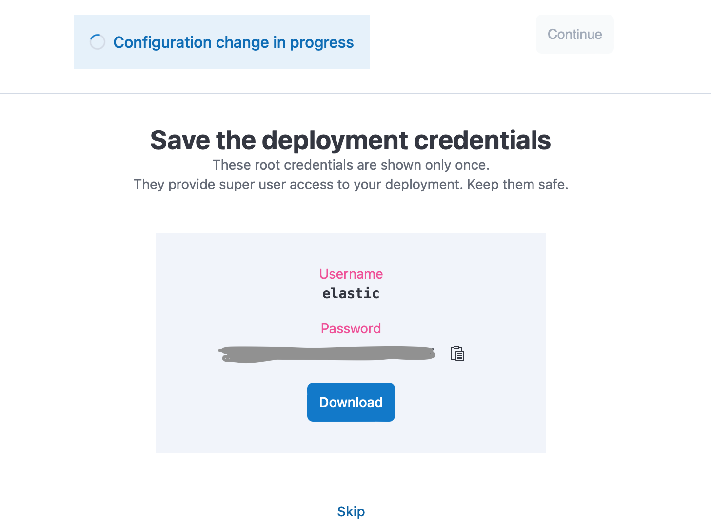

# elastic-GenAI-workshop

## Prerequisites ##

If you would like to try out the hands-on portion of the workshop, you would need:
* Laptop
* A Google account - to access Google Colab

Also, this may require you to get off the company VPN. 

## Create a trial cluster ##

1. Go to https://cloud.elastic.co/ to sign up for a trial account

2. Enter an email and password

3. Create your first deployment

You can choose a cloud provider and a region if you don't want to use the default by clicking on Edit settings. 

4. Download or save the login (elastic) and password

5. Click on continue to proceed to the newly created cluster when it becomes available.

6. In a separate tab, go to https://cloud.elastic.co/home and you will see the new cluster we just created.

7. Copy the *Cloud ID* and save it. We will need it for later.

8. Click on Edit to increase the machine learning node capacity

9. Scroll down to Machine Learning Instances and click on add capacity

10. Choose the largest capacity that is available and click on the Save button near the bottom.

Our cluster is ready for our GenAI use cases now. 

## Google Colab ##

* Go to [http://colab.google.com](https://colab.research.google.com/)

* From the Open Notebook screen, select Github.

* From the GitHub screen, enter the following into the Enter a GitHub URL or search by organizaiton or user
https://github.com/sherry-ger/elastic-workshop/tree/main/GenAI

* Select the notebook you would like to open
