# elastic-workshop
## Ingest Data ##

#### Import CSV in to Elasticsearch ####

#### Create an Elastic work environment ####

1. Go to https://cloud.elastic.co/ to sign up for a trial account
2. Enter an email and password
3. Create your first deployment
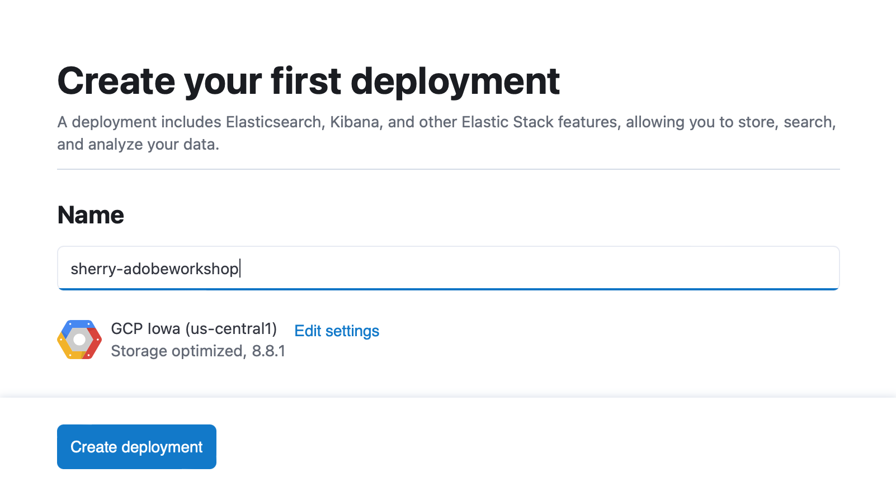
4. Download or save the login (elastic) and password.
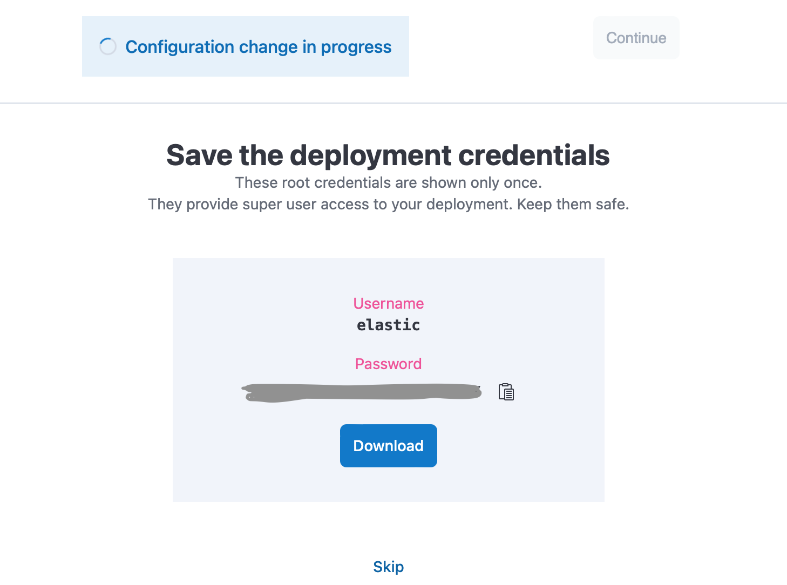
5. Click on continue to proceed to the newly created cluster when it becomes available.

#### Import a CSV into Elastic ####

1. Once you have logged in, type file upload in the searchbox and select Machile Learning/File Upload
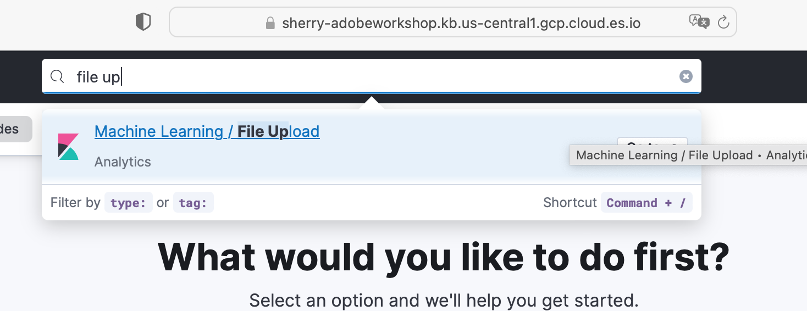

2. Download the file

[2019-michelin-restaurants.csv](Data/2019-michelin-restaurants.csv)

3. Drage and drop the file into the Data Visualizer
4. Elasticsearch will provide file stats and field distributions, much like Panda DataFrame. 
5. Click on import to continue
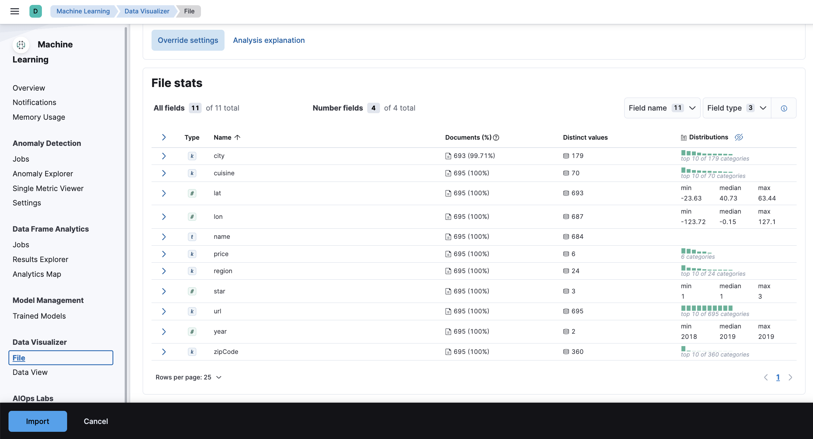

6. Click on the Advanced tab
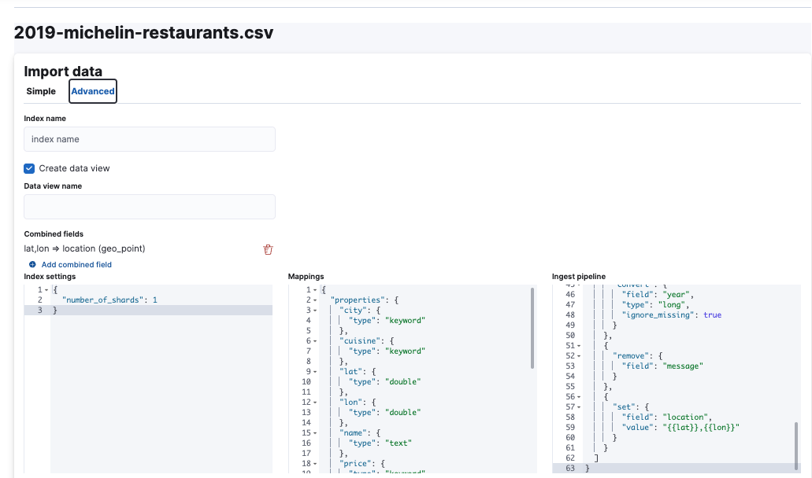
One thing to note here is 

```lat,lon=>location (geo_point)```

The data import recognizes the ```lat``` and ```lon``` fields are a candidate for a ```geo_point``` data type.

7. Add an Index name and click on import
8. Click on View index in Discover
 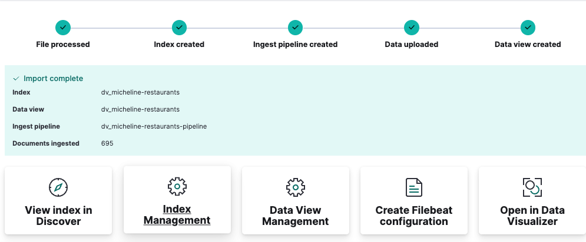

#### Exploring data in discover #### 

1. From the previous exercise, you are redirected to data discover. From here you can explore field stats, filter data, and save query results.
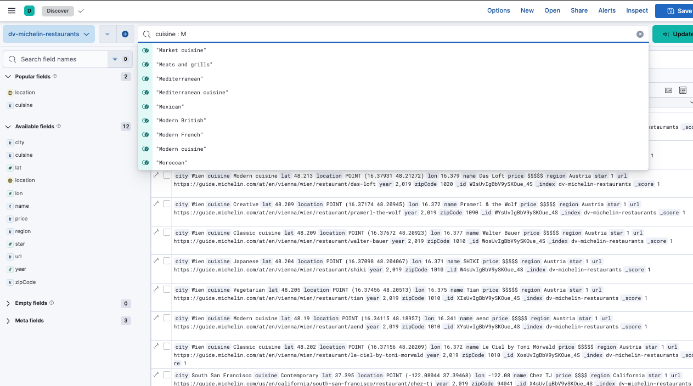

2. You can also start charting directly by mouse over and click on a field and then click on visualize on the popup screen. Here I moused over and clicked on the `region` field and select Visualize

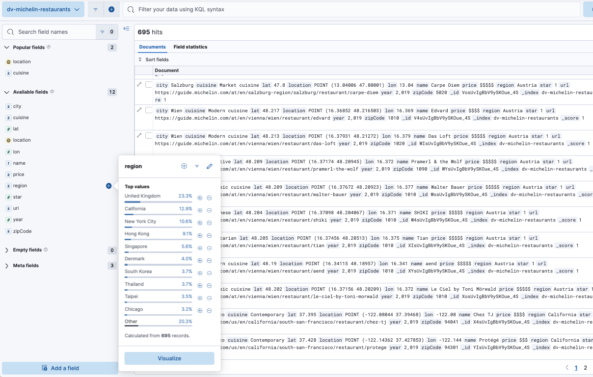

3. It should redirect you to a bar chart. Here are the top 5 regions represented in our data.
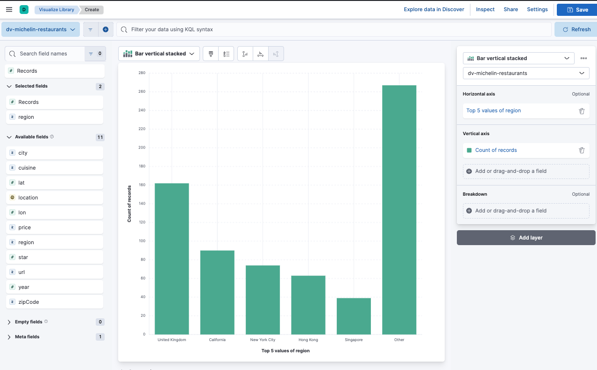

4. Click on `Top 5 values of region`

5. Change `Number of values` to 10 and click on close. 
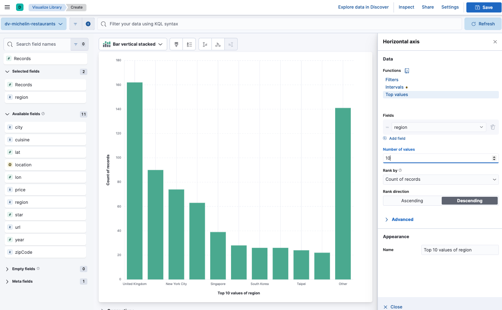

6. Drap and drop the field `star` to `Add or drag-and-drop a field` under `breakdown`. 
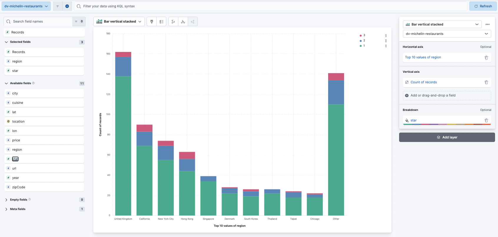

Here we have the top 10 regions broken down by the numbers of stars awarded.

7. The last thing we will do here is click on Bar Chart Stacked and selected Region Map.
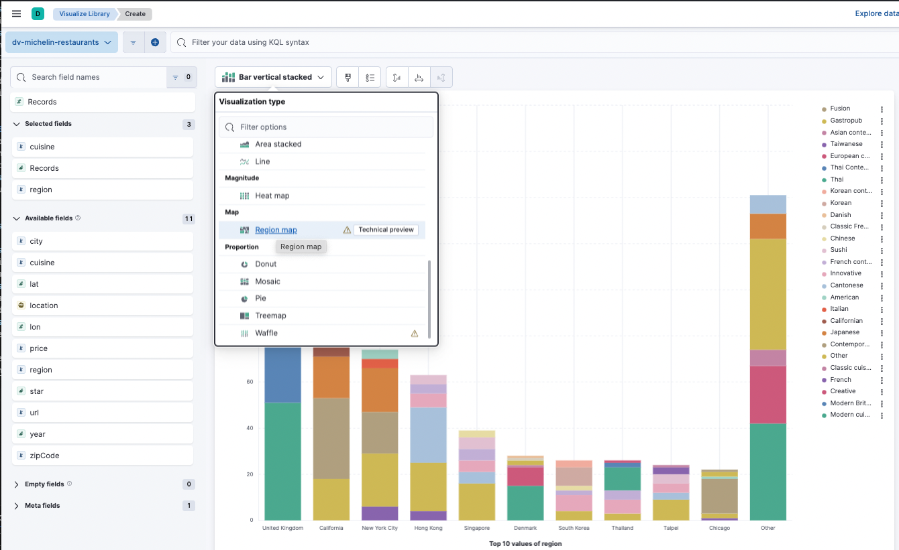

8. Drag and drop the `location` field into the chart. You will be redirected to Elastic Map. 
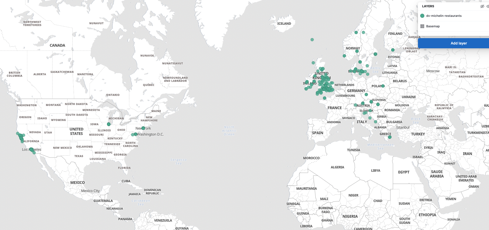

Elasticsearch is an excellent geo data store with many advanced geo search capabilities. Also, there are many more functionalities like chart types, adding layers, and adding calculated values to charts that we did not cover today. Please refer to [Kibana Lens](https://www.elastic.co/guide/en/kibana/current/lens.html) for details.

#### Elasticsearch Via API ####

Before I dive into Elasticsearch APIs, I want to share the [Elasticsearch clients documentation](https://www.elastic.co/guide/en/elasticsearch/client/index.html). Also, in specific, 
[Elasticsearch Python client or Elasticsearch-py](https://github.com/elastic/elasticsearch-py) as Python is a major code language for AI/ML. It also makes leveraging Elasticsearch vector search/similarity search capability easy. 

Here is [the script](DevTools) for our next set of exercises. We will be using [Kibana Dev Tools](https://www.elastic.co/guide/en/kibana/current/devtools-kibana.html).

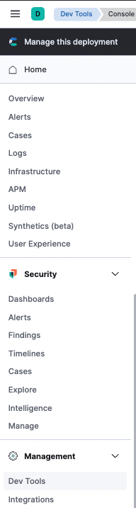
